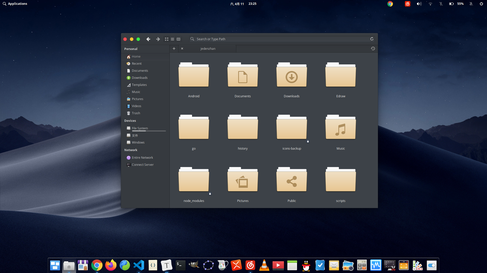

## 我的 Linux 发行版之旅
### elementary
目前包含

- dock 美化文件 `./dock.theme`
- 窗口美化 `elementary-x` 
- 类似 macOS 三指滑动 `使用 libinput-genstrues` 
  - 将 `./libinput-genstrues.conf` 文件内容 copy 到 `/etc/libinput-genstrues.conf` 文件
  - 然后执行 `libinput-genstrues-setup restart 即可`
- 终端我们使用 Tilix `支持多标签页和页面分割功能`
- 桌面壁纸在assets里面

**index脚本里面是单个的命令, 请复制粘贴使用, 不要直接运行!!!**

#### 最终效果

### Pop!_OS
记住 Pop 引导不使用 grub 需要进入 windows 的话开机前五秒内按 esc

### manjaro
- 设置 pacman 源
- 设置 archlinuxcn
  - [archlinuxcn]
  Server = https://mirrors.tuna.tsinghua.edu.cn/archlinuxcn/$arch
- 安装日用软件等等

相关链接
- [elementary-x](https://github.com/surajmandalcell/elementary-x)

- [libinput-genstrues](https://github.com/bulletmark/libinput-gestures)
